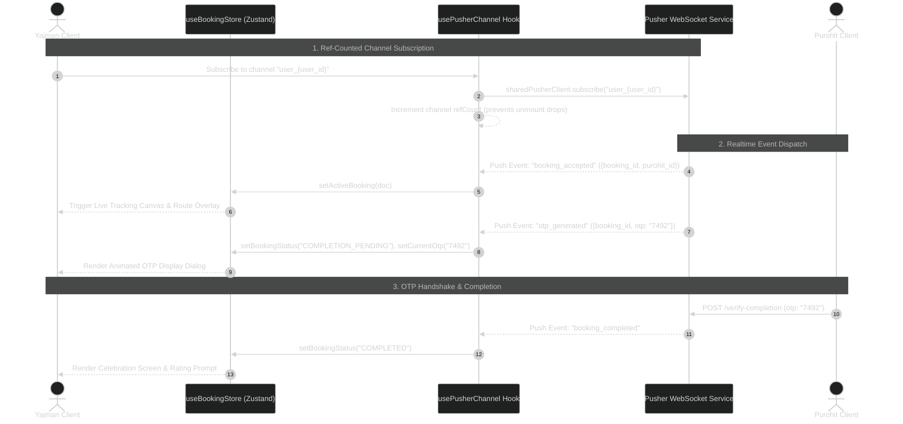

<div align="center">

# 🪔 PujaConnect — Next.js 16 Web Application Client

<p align="center">
  <a href="https://git.io/typing-svg">
    
  </a>
</p>

<p align="center">
  <a href="https://nextjs.org/"></a>
  <a href="https://react.dev/"></a>
  <a href="https://www.typescriptlang.org/"></a>
  <a href="https://tailwindcss.com/"></a>
  <a href="https://zustand-demo.pmnd.rs/"></a>
  <a href="https://tanstack.com/query"></a>
  <a href="https://pusher.com/"></a>
</p>

<p align="center">
  
  
  
  
</p>


</div>

## 🌟 Executive Summary

**PujaConnect Frontend** is a cutting-edge web application client built with **Next.js 16 (Turbopack)**, **React 19**, **Tailwind CSS v4**, **Shadcn UI**, and **Framer Motion**. It provides an intuitive, dual-role dashboard interface for both **Yajmans** (Devotees) and **Purohits** (Priests).

The client communicates seamlessly with the **FastAPI Backend** and **Pusher WebSockets** to provide an Uber-like experience complete with geobroadcast booking requests, live Google Maps driving routes, real-time ETA calculation, and mutual OTP ceremony verification.

---

## ⚡ Core Feature Showcase

<table align="center" width="100%">
  <tr>
    <td width="50%" valign="top">
      <h3>👨‍🦲 Yajman (User) Dashboard</h3>
      <ul>
        <li><b>🚀 Uber-Style Broadcast Request</b>: One-tap creation specifying location, date-time, ceremony category, and Dakshina budget.</li>
        <li><b>🗺️ Live Priest Tracking</b>: Interactive Google Maps canvas rendering priest marker movement, user location, and dynamic driving polyline.</li>
        <li><b>⏱️ Distance & ETA Overlay</b>: Live polling of driving distance and arrival time.</li>
        <li><b>🔐 OTP Display Modal</b>: Animated popup displaying the 4-digit completion code when the priest finishes the ceremony.</li>
      </ul>
    </td>
    <td width="50%" valign="top">
      <h3>🪔 Purohit (Priest) Dispatch Console</h3>
      <ul>
        <li><b>🎛️ Matching Engine Switch</b>: Online/Offline toggle with automatic browser Geolocation (<code>watchPosition</code>) streaming.</li>
        <li><b>🔔 Incoming Request Modal</b>: Real-time modal popping up when a nearby broadcast request lands within priest radius.</li>
        <li><b>🔒 Atomic Accept</b>: First-responder acceptance lock with optimistic feedback.</li>
        <li><b>📲 OTP Verification Slot</b>: <code>input-otp</code> component for entering the user's verbal code to close bookings.</li>
      </ul>
    </td>
  </tr>
</table>

---

> [!NOTE]
> **Edge Middleware Route Protection**: Middleware reads token & role cookies mirrored by `useAuthStore` at the edge to protect `/user/*` and `/purohit/*` routes without blocking client hydration.

---

## 🚀 Client Architecture & Workflow Diagrams

### 1. Dual-Role Component & State Flowchart

```mermaid
%%{init: {'theme': 'dark', 'themeVariables': { 'primaryColor': '#FF8C00', 'primaryTextColor': '#fff', 'lineColor': '#06B6D4'}}}%%
flowchart TD
    subgraph Root Shell ["Root Layout (app/layout.tsx)"]
        AP[AppProviders: Theme + React Query + Toaster]
        BG[AuroraBackground Canvas]
    end

    subgraph AuthBoundary ["Auth Boundary"]
        LP[app/login/page.tsx - OAuth2 Password Form]
        SP[app/signup/page.tsx - Role-based Signup]
    end

    subgraph UserSpace ["Yajman Space (/user)"]
        UD[UserBentoDashboard]
        UB[Request Generator - app/user/book]
        UA[ActiveBooking Component]
        LT[LiveTrackingPanel - Google Maps]
    end

    subgraph PriestSpace ["Purohit Space (/purohit)"]
        PD[PurohitDashboard]
        OT[OnlineToggle - Geolocation Watcher]
        PA[ActiveBooking - OTP Input Slot]
        IRM[IncomingRequestModal]
    end

    Root Shell --> AuthBoundary
    Root Shell --> UserSpace
    Root Shell --> PriestSpace

    UA -->|Active Status| LT
    PA -->|COMPLETION_PENDING| IRM
```

### 2. Ref-Counted WebSocket Subscription Sequence



---

## 🛠️ Stack & Technology Matrix

<details open>
<summary><b>Frontend Dependencies Breakdown</b></summary>

<br />

| Layer | Library / Tool | Version | Role & Functionality |
|:---|:---|:---|:---|
| **Meta-Framework** | `Next.js` | `16.2.11` | React framework with Turbopack, App Router & Edge Middleware |
| **UI Library** | `React` | `19.2.4` | Core UI engine using modern concurrent rendering features |
| **Language** | `TypeScript` | `^5.0` | Strict static type checking across models and components |
| **Client State** | `Zustand` | `^5.0` | Client state (`useAuthStore` with localStorage & `useBookingStore`) |
| **Server State** | `TanStack Query` | `^5.101` | Server state caching, background refetching & optimistic updates |
| **Realtime WebSockets**| `pusher-js` | `^8.5` | Client-side WebSocket manager for Pusher channel subscriptions |
| **HTTP Interceptor**| `Axios` | `^1.18` | Interceptor-backed HTTP client for JWT injection & 401 handling |
| **Styling** | `Tailwind CSS` | `^4` | Utility-first CSS styling with `@theme` token definitions |
| **Component Kit** | `Shadcn UI` / `Radix` | `^1.6` | Accessible headless UI primitives (Dialog, Tabs, Popover) |
| **Animation** | `Framer Motion` | `^12.42` | Layout transitions, spring animations & modal gestures |
| **Maps Integration**| `@react-google-maps/api` | `^2.20` | Dynamic Google Map canvas, markers, directions & route rendering |
| **OTP Input Slot** | `input-otp` | `^1.4` | Customized 4-digit input slot component for verification |

</details>

---

## 📁 Repository Directory Layout

```text
Purohit_Frontend/
├── app/
│   ├── (auth)/
│   │   ├── layout.tsx            # Clean auth page layout
│   │   ├── login/page.tsx        # OAuth2 password flow login page
│   │   └── signup/page.tsx       # User & Purohit tabbed signup page
│   ├── (dashboard)/
│   │   ├── purohit/
│   │   │   ├── bookings/page.tsx # Priest booking history
│   │   │   ├── components/       # ActiveBooking (OTP input slot) & OnlineToggle
│   │   │   ├── profile/page.tsx  # Priest expertise & radius manager
│   │   │   └── page.tsx          # Priest dispatch control center
│   │   └── user/
│   │       ├── book/page.tsx     # Uber-style ceremony request generator
│   │       ├── bookings/page.tsx # User ceremony history
│   │       ├── components/       # ActiveBooking (Live map & OTP modal)
│   │       ├── profile/page.tsx  # Address manager & profile editor
│   │       └── page.tsx          # Bento grid user dashboard
│   ├── globals.css               # Tailwind directives & CSS theme tokens
│   ├── layout.tsx                # Root layout with providers & background
│   └── page.tsx                  # Public landing page
├── components/
│   ├── booking/                  # LiveTrackingPanel & IncomingRequestModal
│   ├── dashboard/                # User & Purohit bento dashboard cards
│   ├── map/                      # Google Map radius picker & location picker
│   ├── shared/                   # Aurora background, loading skeletons, API error alerts
│   └── ui/                       # Shadcn UI primitives (Button, Card, Dialog, etc.)
├── hooks/
│   ├── useAuth.ts                # React Query auth & profile hydration hooks
│   └── usePusherChannel.ts       # Ref-counted Pusher channel subscription hook
├── lib/
│   ├── api/                      # Axios API modules (auth, bookings, purohits, users)
│   ├── constants.ts              # API URLs, Pusher keys, default coordinates
│   └── google-maps-loader.ts     # Google Maps JS API script loader config
├── providers/                    # QueryProvider, ThemeProvider & AppProviders
├── store/
│   ├── useAuthStore.ts           # Persisted auth state & cookie edge mirror
│   └── useBookingStore.ts        # Active booking & OTP state store
├── types/                        # TypeScript interfaces matching backend models
├── middleware.ts                 # Next.js Edge Middleware route guard
└── next.config.ts                # Next.js configuration
```

---

## ⚡ Quickstart Setup Guide

```bash
# 1. Clone & navigate to frontend directory
git clone https://github.com/your-username/Purohit_Booking_System.git
cd Purohit_Booking_System/Purohit_Frontend

# 2. Copy environment file
cp .env.local.example .env.local

# 3. Install dependencies
npm install

# 4. Launch Next.js dev server with Turbopack
npm run dev
```

> [!TIP]
> Open **http://localhost:3000** in your browser to view the application!

---

<div align="center">


### Crafted with ❤️ for Next-Gen Spiritual Web Applications

</div>
